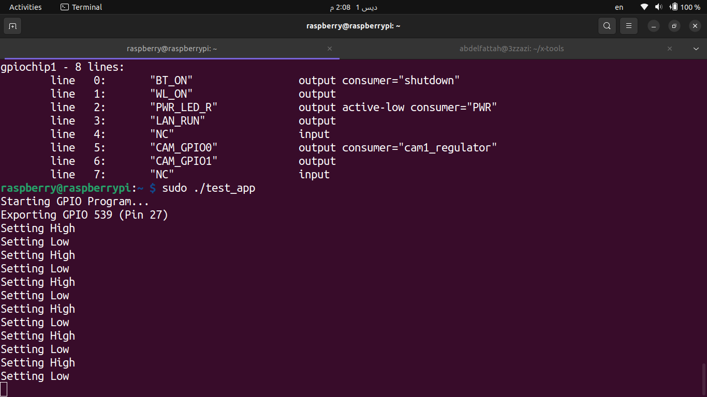
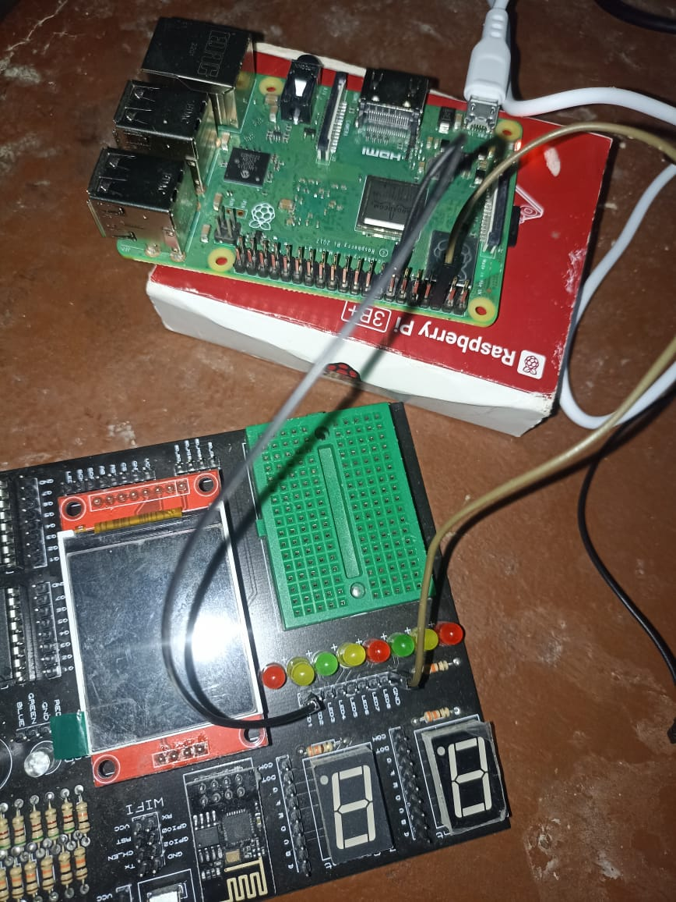
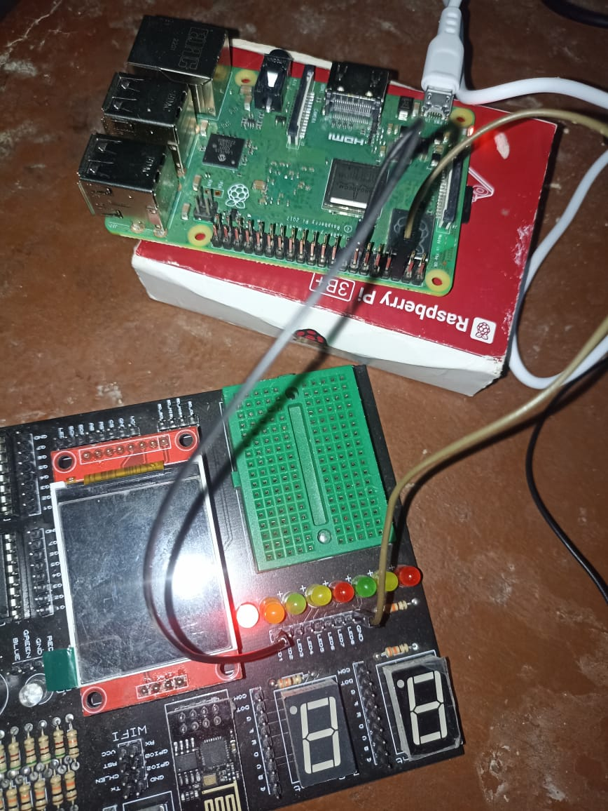
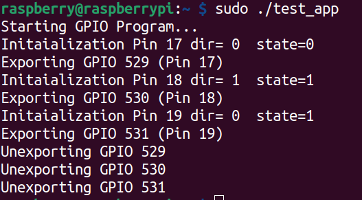
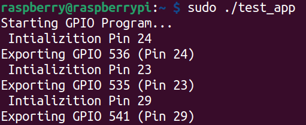

# C++ OOP GPIO Control for Raspberry Pi 3 (Cross-Compiled)

This project implements a C++ Object-Oriented wrapper for the Linux `sysfs` GPIO interface. It allows for controlling Raspberry Pi 3 GPIO pins using high-level abstractions (classes, vectors, and move semantics).

The project is cross-compiled on a host Linux machine using a custom **Crosstool-NG** toolchain targeting **AArch64** (ARM64) and transferred to the target hardware via **SCP**.

## 1. Project Overview

### Features
*   **OOP Design:** Encapsulates GPIO logic within the `MCAL::GPIO::GpioPin` class.
*   **RAII Principle:** 
    *   **Constructor:** Automatically "exports" the pin via sysfs.
    *   **Destructor:** Automatically "unexports" the pin to free resources when the object goes out of scope.
*   **Move Semantics:** Implements Move Constructors and Move Assignment operators (Rule of 5) to safely manage file descriptors and prevent double-freeing resources. Copying is disabled to ensure unique ownership of a physical pin.
*   **Bulk Initialization:** Supports initializing multiple pins with uniform or distinct configurations using `std::vector` and `std::initializer_list`.

### Hardware Configuration
*   **Target:** Raspberry Pi 3 (Running 64-bit Linux).
*   **GPIO Base:** The code is configured with `GPIO_BASE = 512`. 
    *   *Note: This offset is specific to the OS version (often Ubuntu Server). Standard Raspberry Pi OS might use offset 0 or 399.*

## 2. Environment Setup

Before compiling, the custom toolchain was added to the system `PATH`.

**Toolchain Path:** `~/x-tools/aarch64-rpi3-linux-gnu/bin`

Command used to export the path:
```bash
export PATH=$PATH:~/x-tools/aarch64-rpi3-linux-gnu/bin
```

## 3. Compilation Steps

### Step 1: Sanity Check (Demo)
First, a simple `demo.cpp` was compiled to verify the toolchain configuration.
```bash
aarch64-rpi3-linux-gnu-g++ -o demo_app demo.cpp
```

### Step 2: Compile GPIO Application
The main OOP GPIO implementation was compiled using `g++`.
```bash
aarch64-rpi3-linux-gnu-g++ -o gpio_app gpio.cpp
```

### Step 3: Verification
We verified the binary architecture using the `file` command to ensure it was built for ARM64.
```bash
file gpio_app
```
**Output:** `ELF 64-bit LSB executable, ARM aarch64...`

## 4. File Transfer (SCP)

Since the code was compiled on a host PC (x86), the binary files were transferred to the Raspberry Pi using `scp` (Secure Copy Protocol).

**Syntax:**
`scp <source_file> <username>@<pi_ip_address>:<destination_path>`

**Command used to transfer the GPIO app:**
```bash
scp ./gpio_app raspberry@raspberrypi.local:/home/raspberry/
```

## 5. Execution on Raspberry Pi


1.  **Navigate to the directory:**
    ```bash
    cd /home/raspberry/
    ```

2.  **Run the application:**
    Root privileges (`sudo`) are required to access the `/sys/class/gpio` hardware interface.
    ```bash
    sudo ./gpio_app
    ```

## 6.Code Usage Example

- The application performs two primary demonstrations in the main function:
 - LED State Control:
        - Initializes a GPIO pin.
        - Sets state to High (LED ON) and prints GPIO_18 State: High.
        - Sets state to Low (LED OFF) and prints GPIO_18 State: Low.
        - Delays are included to allow for hardware observation.
   
  
  
  
  
  


- Configuration Logic Verification:
      - Compares different PinConfig structures.
      - Detects if a new configuration matches the existing one.
      - Outputs Config Check: SAME CFG or Config Check: DIFF CFG to the terminal based on the parameters.

  
  
  

   
