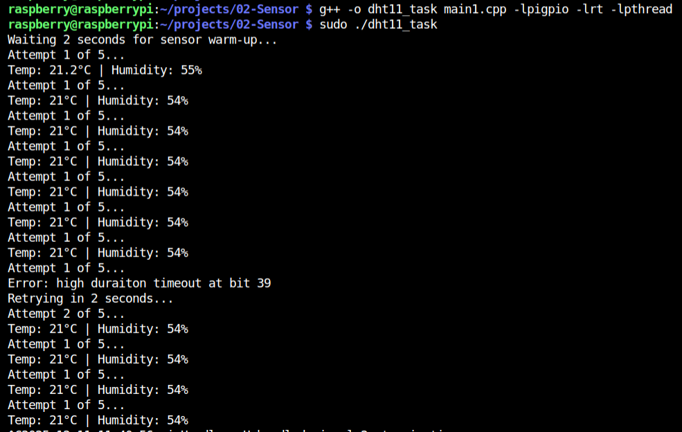
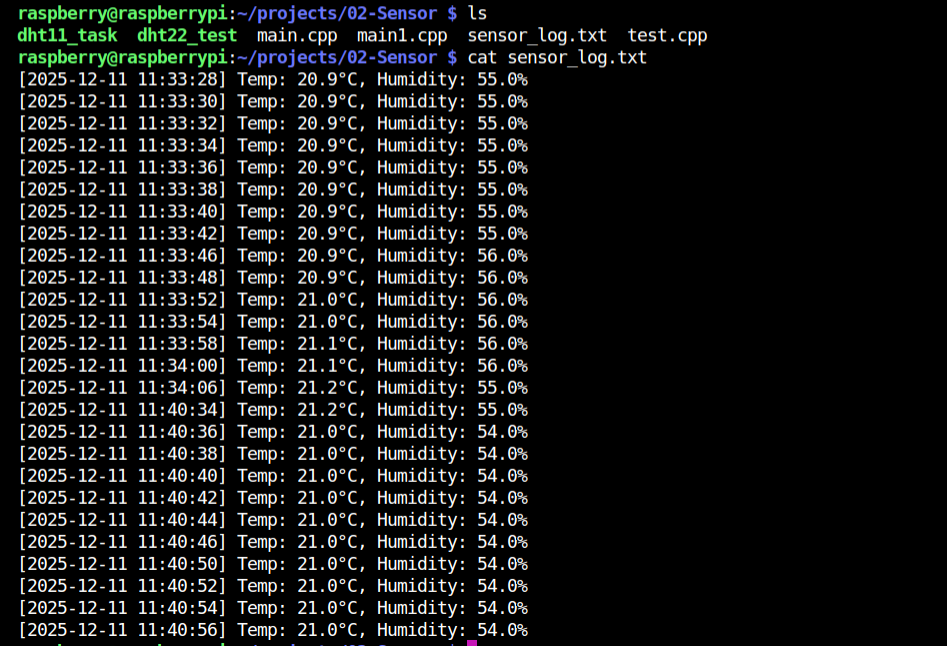

# 🌡️ DHT11 Temperature & Humidity Sensor - Raspberry Pi 3

> A Modern C++ implementation for reading temperature and humidity from DHT11 sensor using Raspberry Pi 3 GPIO with pigpio library.


---

## 📋 Table of Contents

- [Project Overview](#-project-overview)
- [Hardware Requirements](#-hardware-requirements)
- [Wiring Diagram](#-wiring-diagram)
- [DHT11 Protocol Deep Dive](#-dht11-protocol-deep-dive)
- [Software Architecture](#-software-architecture)
- [Modern C++ Features Used](#-modern-c-features-used)
- [Class Design](#-class-design)
- [Build & Run](#-build--run)
- [Output Examples](#-output-examples)
- [Troubleshooting](#-troubleshooting)
- [Lessons Learned](#-lessons-learned)
---

## 🎯 Project Overview

This project demonstrates how to:

- Interface with DHT11 temperature/humidity sensor
- Implement a custom single-wire protocol using GPIO
- Design clean OOP architecture with inheritance
- Use modern C++ features (smart pointers, RAII, enum class)
- Handle real-time timing challenges on Linux
- Log sensor data to files using POSIX file descriptors

---

## 🔧 Hardware Requirements

| Component | Quantity | Notes |
|-----------|----------|-------|
| Raspberry Pi 3 | 1 | Any model with GPIO |
| DHT11 Sensor Module | 1 | With built-in pull-up resistor |
| Jumper Wires | 3 | Female-to-Female |

---

## 🔌 Wiring Diagram

### DHT11 Module Pinout:

```
┌───────────────┐
│   DHT11       │
│  ┌───────┐    │
│  │ Sensor│    │
│  └───────┘    │
│   +  S  -     │
│   ○  ○  ○     │
└───┬──┬──┬─────┘
    │  │  │
   VCC DATA GND
```

### Connection to Raspberry Pi 3:

```
DHT11 Module        Raspberry Pi 3
────────────        ──────────────
VCC (or +)    →     Pin 1  (3.3V)
DATA (or S)   →     Pin 7  (GPIO 4)
GND (or -)    →     Pin 6  (GND)
```

### Raspberry Pi 3 GPIO Header:

```
                3.3V  (1)  (2)  5V      ← VCC connects here
      I2C SDA GPIO 2  (3)  (4)  5V
      I2C SCL GPIO 3  (5)  (6)  GND     ← GND connects here
              GPIO 4  (7)  (8)  GPIO 14 ← DATA connects here
                GND   (9)  (10) GPIO 15
              GPIO 17 (11) (12) GPIO 18
              GPIO 27 (13) (14) GND
              GPIO 22 (15) (16) GPIO 23
                3.3V  (17) (18) GPIO 24
              GPIO 10 (19) (20) GND
              GPIO 9  (21) (22) GPIO 25
              GPIO 11 (23) (24) GPIO 8
                GND   (25) (26) GPIO 7
```

---

## 📡 DHT11 Protocol Deep Dive

### Communication Overview

The DHT11 uses a **proprietary single-wire protocol** (NOT I2C, NOT SPI). Both the Raspberry Pi and sensor share the same data line, communicating in **half-duplex** mode.

### Communication Sequence:

```
┌─────────────────────────────────────────────────────────────────┐
│                    COMMUNICATION FLOW                           │
├─────────────────────────────────────────────────────────────────┤
│                                                                 │
│  Step 1: Pi sends START signal                                  │
│  ─────────────────────────────                                  │
│          │                                                      │
│          ▼                                                      │
│  Step 2: Sensor sends ACKNOWLEDGMENT                            │
│  ───────────────────────────────────                            │
│          │                                                      │
│          ▼                                                      │
│  Step 3: Sensor sends 40 BITS of data                          │
│  ────────────────────────────────────                           │
│          │                                                      │
│          ▼                                                      │
│  Step 4: Communication ENDS                                     │
│                                                                 │
└─────────────────────────────────────────────────────────────────┘
```

### Timing Diagram:

```Here's the improved timing diagram:

---

```markdown
### Timing Diagram:

═══════════════════════════════════════════════════════════════════════════════
                           START SIGNAL (Pi → Sensor)
═══════════════════════════════════════════════════════════════════════════════

    Pi pulls LOW            Pi releases (HIGH)
    for 18ms                for 20-40μs
    ◄──────────────────────►◄─────────►
                            
────────┐                   ┌──────────┐
        │                   │          │
        │                   │          │
        │      18ms         │  20-40μs │
        │                   │          │
        └───────────────────┘          └─────────── (Sensor takes over)
        
        ▲                   ▲          ▲
        │                   │          │
      START               RELEASE    SENSOR
      LOW                  HIGH      RESPONDS


═══════════════════════════════════════════════════════════════════════════════
                      SENSOR ACKNOWLEDGMENT (Sensor → Pi)
═══════════════════════════════════════════════════════════════════════════════

    Sensor pulls LOW        Sensor pulls HIGH
    (I received your        (I'm ready to send
     start signal!)          data now!)
    ◄──────────────────────►◄──────────────────────►

────────┐                   ┌──────────────────────┐
        │                   │                      │
        │                   │                      │
        │      ~80μs        │        ~80μs         │
        │                   │                      │
        └───────────────────┘                      └─────────── (Data starts)
        
        ▲                   ▲                      ▲
        │                   │                      │
      LOW ACK            HIGH ACK              DATA BEGIN


═══════════════════════════════════════════════════════════════════════════════
                              BIT ENCODING
═══════════════════════════════════════════════════════════════════════════════

Every bit has TWO parts:
  1. LOW marker  (~50μs) - "Hey, a bit is coming!"
  2. HIGH signal (variable) - The actual bit value

───────────────────────────────────────────────────────────────────────────────
                              "0" BIT (Short HIGH)
───────────────────────────────────────────────────────────────────────────────

    LOW marker              SHORT HIGH = "0"
    (same for all bits)     (26-28μs means bit is 0)
    ◄──────────────────────►◄────────►

────────┐                   ┌────────┐
        │                   │        │
        │                   │        │
        │      ~50μs        │ 26-28μs│
        │                   │  SHORT │
        └───────────────────┘        └──────────────────────────
        
        ▲                   ▲        ▲
        │                   │        │
     MARKER              BIT "0"   NEXT BIT
     (always same)       (short)   MARKER


───────────────────────────────────────────────────────────────────────────────
                              "1" BIT (Long HIGH)
───────────────────────────────────────────────────────────────────────────────

    LOW marker              LONG HIGH = "1"
    (same for all bits)     (70μs means bit is 1)
    ◄──────────────────────►◄──────────────────────►

────────┐                   ┌──────────────────────┐
        │                   │                      │
        │                   │                      │
        │      ~50μs        │        ~70μs         │
        │                   │        LONG          │
        └───────────────────┘                      └────────────
        
        ▲                   ▲                      ▲
        │                   │                      │
     MARKER              BIT "1"                NEXT BIT
     (always same)       (long)                 MARKER


═══════════════════════════════════════════════════════════════════════════════
                           COMPLETE DATA TRANSFER
═══════════════════════════════════════════════════════════════════════════════

Example: Sending "1", "0", "1"

    ◄─────────►◄──────────────────────►◄─────────►◄────────►◄─────────►◄──────────────────────►
      MARKER          BIT "1"           MARKER    BIT "0"    MARKER          BIT "1"

        ┌──────────────────────┐        ┌────────┐          ┌──────────────────────┐
        │                      │        │        │          │                      │
        │        ~70μs         │        │ ~28μs  │          │        ~70μs         │
────────┘                      └────────┘        └──────────┘                      └────────
  ~50μs                          ~50μs             ~50μs

    ▲              ▲               ▲        ▲         ▲              ▲
    │              │               │        │         │              │
  marker        bit=1           marker    bit=0    marker          bit=1


═══════════════════════════════════════════════════════════════════════════════
                              HOW TO DECODE A BIT
═══════════════════════════════════════════════════════════════════════════════

    Step 1: Wait for LOW marker to end
    Step 2: Measure how long HIGH lasts
    Step 3: Decide bit value:
    
    ┌─────────────────────────────────────────────────┐
    │                                                 │
    │   HIGH duration < 40μs  ──────►  Bit = 0       │
    │                                                 │
    │   HIGH duration > 40μs  ──────►  Bit = 1       │
    │                                                 │
    └─────────────────────────────────────────────────┘

    In code:
    ┌─────────────────────────────────────────────────┐
    │  int duration = MeasureHighDuration();          │
    │                                                 │
    │  if (duration > 40) {                          │
    │      bit = 1;                                   │
    │  } else {                                       │
    │      bit = 0;                                   │
    │  }                                              │
    └─────────────────────────────────────────────────┘
```

### Data Format (40 bits = 5 bytes):

```
┌──────────┬──────────┬──────────┬──────────┬──────────┐
│ Byte 0   │ Byte 1   │ Byte 2   │ Byte 3   │ Byte 4   │
├──────────┼──────────┼──────────┼──────────┼──────────┤
│ Humidity │ Humidity │   Temp   │   Temp   │ Checksum │
│ Integer  │ Decimal  │ Integer  │ Decimal  │          │
└──────────┴──────────┴──────────┴──────────┴──────────┘

Example: 54% humidity, 20.9°C
─────────────────────────────
Byte 0: 0x36 (54)  → Humidity integer
Byte 1: 0x00 (0)   → Humidity decimal
Byte 2: 0x14 (20)  → Temperature integer
Byte 3: 0x09 (9)   → Temperature decimal (0.9)
Byte 4: 0x53       → Checksum (0x36+0x00+0x14+0x09 = 0x53)
```

### Checksum Validation:

```cpp
checksum = byte0 + byte1 + byte2 + byte3
// Only lower 8 bits are compared
if ((checksum & 0xFF) == byte4) {
    // Data is valid!
}
```

### DHT11 vs DHT22 Data Format:

| Sensor | Data Format | Temperature Range | Humidity Range |
|--------|-------------|-------------------|----------------|
| **DHT11** | Integer + Decimal bytes | 0-50°C | 20-80% |
| **DHT22** | 16-bit combined value ÷ 10 | -40-80°C | 0-100% |

```cpp
// DHT11 extraction:
float temp = buffer[2] + buffer[3] / 10.0f;
float humidity = buffer[0] + buffer[1] / 10.0f;

// DHT22 extraction:
uint16_t rawTemp = (buffer[2] << 8) | buffer[3];
float temp = rawTemp / 10.0f;
```

---

##  Software Architecture

### 🏗️ Class Hierarchy:

```
┌─────────────────────────────────────────────────────────┐
│                    Application Layer                     │
│                       main.cpp                          │
└────────────────────────┬────────────────────────────────┘
                         │ uses
          ┌──────────────┴──────────────┐
          ▼                             ▼
┌──────────────────┐          ┌──────────────────┐
│   DHT11 Class    │          │ SensorLogger     │
│   (Concrete)     │          │ (Logging)        │
└────────┬─────────┘          └──────────────────┘
         │ inherits
         ▼
┌──────────────────┐
│   Sensor Class   │
│   (Abstract)     │
└────────┬─────────┘
         │ uses
         ▼
┌──────────────────┐
│   GPIO Class     │
│   (Hardware)     │
└────────┬─────────┘
         │ uses
         ▼
┌──────────────────┐
│   pigpio Library │
│   (Low-level)    │
└──────────────────┘
```

### Design Patterns Used:

| Pattern | Where | Purpose |
|---------|-------|---------|
| **RAII** | GPIO, SensorLogger | Resource management |
| **Template Method** | Sensor → DHT11 | Inheritance |
| **Singleton-like** | GPIO::InstanceCounter | pigpio init/terminate once |

---

## 💎 Modern C++ Features Used

### 1. Smart Pointers (`std::unique_ptr`)

```cpp
class DHT11 : public Sensor {
private:
    std::unique_ptr<GPIO> _gpio;  // Automatic memory management
    
public:
    explicit DHT11(PinNumber pin) 
        : _gpio{std::make_unique<GPIO>(pin)}  // Safe creation
    {}
    // No need for destructor - unique_ptr handles cleanup!
};
```

**Why?**
- Automatic memory deallocation
- No memory leaks
- Clear ownership semantics

### 2. Enum Classes (Scoped Enums)

```cpp
// Old C-style enum (BAD):
enum PinValue { Low, High };  // Pollutes global namespace

// Modern C++ enum class (GOOD):
enum class PinValue {
    Low,
    High
};

// Usage requires scope:
PinValue val = PinValue::High;  // Clear and type-safe
```

**Why?**
- Type safety (can't mix with integers)
- No name collisions
- Self-documenting code

### 3. Structured Bindings (C++17)

```cpp
// Old way:
auto result = sensor.ReadSensorData();
SensorStatus status = result.first;
SensorReading reading = result.second;

// Modern C++17 way:
auto [status, reading] = sensor.ReadSensorData();
```

### 4. `std::array` Instead of C Arrays

```cpp
// C-style array (BAD):
uint8_t buffer[5];

// Modern C++ (GOOD):
std::array<uint8_t, 5> buffer;
buffer.fill(0);  // Member functions available!
buffer.size();   // Knows its own size!
```

### 5. `explicit` Keyword

```cpp
explicit GPIO(PinNumber pin);
explicit DHT11(PinNumber pin);
```

**Why?** Prevents accidental implicit conversions:
```cpp
GPIO gpio = 4;        // ❌ Compile error with explicit
GPIO gpio(PinNumber::GPIO_PIN_4);  // ✅ Must be intentional
```

### 6. `override` Keyword

```cpp
class DHT11 : public Sensor {
    std::pair<SensorStatus, SensorReading> ReadSensorData() override;
    //                                                      ^^^^^^^^
    // Compiler checks that we're actually overriding a virtual function
};
```

### 7. `= delete` and `= default`

```cpp
class GPIO {
    // Prevent copying (each pin has ONE owner)
    GPIO(const GPIO&) = delete;
    GPIO& operator=(const GPIO&) = delete;
    
    // Allow moving (transfer ownership)
    GPIO(GPIO&&) = default;
    GPIO& operator=(GPIO&&) = default;
};
```

### 8. `static constexpr`

```cpp
class DHT11 {
    static constexpr int MAX_RETRIES = 5;  // Compile-time constant
};
```

### 9. RAII (Resource Acquisition Is Initialization)

```cpp
class GPIO {
public:
    GPIO(PinNumber pin) {
        // Acquire resource (initialize GPIO)
        if (InstanceCounter == 0) {
            gpioInitialise();
        }
        InstanceCounter++;
    }
    
    ~GPIO() {
        // Release resource (cleanup GPIO)
        InstanceCounter--;
        if (InstanceCounter == 0) {
            gpioTerminate();
        }
    }
};
// Resource is automatically cleaned up when object goes out of scope!
```

---

## 📐 Class Design

### GPIO Class

```cpp
class GPIO
{
private:
    PinNumber pinNumber;
    PinValue pinValue;
    PinDirection pinDir;
    static uint32_t InstanceCounter;  // Tracks all GPIO instances

public:
    explicit GPIO(PinNumber pin);     // Initialize pin
    ~GPIO();                          // Cleanup
    
    // Deleted copy (pin has one owner)
    GPIO(const GPIO&) = delete;
    GPIO& operator=(const GPIO&) = delete;
    
    // Allow move (transfer ownership)
    GPIO(GPIO&&) = default;
    GPIO& operator=(GPIO&&) = default;
    
    // Operations
    void SetValue(PinValue value);
    PinValue GetValue() const;
    void SetDir(PinDirection dir);
    PinDirection GetDir() const;
};
```

**Static Counter Pattern:**

```
┌─────────────────────────────────────────────────────────┐
│              GPIO Instance Counter                       │
├─────────────────────────────────────────────────────────┤
│                                                         │
│  Create GPIO_1:  counter 0→1  → gpioInitialise()       │
│  Create GPIO_2:  counter 1→2  → (nothing)              │
│  Create GPIO_3:  counter 2→3  → (nothing)              │
│  Destroy GPIO_3: counter 3→2  → (nothing)              │
│  Destroy GPIO_2: counter 2→1  → (nothing)              │
│  Destroy GPIO_1: counter 1→0  → gpioTerminate()        │
│                                                         │
└─────────────────────────────────────────────────────────┘
```

### Sensor Base Class (Abstract)

```cpp
class Sensor
{
public:
    Sensor() = default;
    virtual ~Sensor() = default;
    
    // Pure virtual - must be implemented by derived classes
    virtual std::pair<SensorStatus, SensorReading> ReadSensorData() = 0;
};
```

### DHT11 Class (Concrete)

```cpp
class DHT11 : public Sensor
{
private:
    std::array<uint8_t, 5> buffer;
    std::unique_ptr<GPIO> _gpio;
    static constexpr int MAX_RETRIES = 5;

public:
    DHT11() = delete;  // No default constructor
    explicit DHT11(PinNumber pin);
    
    // Override base class method
    std::pair<SensorStatus, SensorReading> ReadSensorData() override;

private:
    // Helper methods
    SensorStatus checkSum() const;
    float extractTemperature() const;
    float extractHumidity() const;
    SensorStatus waitForPin(PinValue expected, uint32_t timeoutMicros);
    int MeasureHighDuration();
};
```

### SensorLogger Class

```cpp
class SensorLogger
{
private:
    std::string m_filename;
    int m_fd;
    char m_timeBuffer[64];
    char m_logBuffer[128];

public:
    explicit SensorLogger(const std::string& name);
    ~SensorLogger();
    
    // Deleted copy (file descriptor shouldn't be shared)
    SensorLogger(const SensorLogger&) = delete;
    SensorLogger& operator=(const SensorLogger&) = delete;
    
    void log(const SensorReading& reading);
};
```

---

## 🔨 Build & Run

### Prerequisites:

```bash
# Install pigpio library (on Raspberry Pi)
cd ~
wget https://github.com/joan2937/pigpio/archive/master.zip
unzip master.zip
cd pigpio-master
make
sudo make install
```

### Compile:

```bash
g++ -o dht11_app main.cpp -lpigpio -lrt -lpthread
```

### Run:

```bash
# Must run as root for GPIO access
sudo ./dht11_app
```

### Stop:

```bash
# Press Ctrl+C to stop
# If not cleanly stopped, run:
sudo pkill -9 dht11_app
sudo rm -f /var/run/pigpio.pid
```

---

## 📊 Output Examples

### Console Output:

```
Waiting 2 seconds for sensor warm-up...
Logging to: sensor_log.txt
Attempt 1 of 5...
Temp: 20.9°C | Humidity: 54%
Attempt 1 of 5...
Temp: 21.0°C | Humidity: 53%
Attempt 1 of 5...
Temp: 20.9°C | Humidity: 54%
```



### Log File (`sensor_log.txt`):

```
[2024-12-15 14:30:45] Temp: 20.9C, Humidity: 54%
[2024-12-15 14:30:47] Temp: 21.0C, Humidity: 53%
[2024-12-15 14:30:49] Temp: 20.9C, Humidity: 54%
[2024-12-15 14:30:51] Temp: 20.9C, Humidity: 54%
```



---

## 🔧 Troubleshooting

### Common Errors:

| Error | Cause | Solution |
|-------|-------|----------|
| `Can't lock /var/run/pigpio.pid` | Previous instance running | `sudo rm /var/run/pigpio.pid` |
| `bind to port 8888 failed` | pigpio daemon running | `sudo pkill -9 dht11_app` |
| `GPIO Init Failed` | No root permission | Run with `sudo` |
| `Timeout waiting for LOW ack` | Wrong wiring | Check connections |
| `Checksum error` | Timing issues | Automatic retry handles this |
| `Temperature: 0°C` | Timing measurement wrong | Use `gpioTick()` not counter |

### Debug Commands:

```bash
# Check if pigpio is running
ps aux | grep pigpio

# Check what's using port 8888
sudo lsof -i :8888

# Kill stuck processes
sudo pkill -9 dht11_app
sudo pkill -9 pigpiod

# Remove lock file
sudo rm -f /var/run/pigpio.pid
```

---

## 🎓 Lessons Learned

### 1. Linux is NOT Real-Time

Linux can pause your program at any moment for system tasks. This causes timing issues with microsecond-precision protocols.

**Solution:** Implement retry logic!

```cpp
for (int attempt = 1; attempt <= MAX_RETRIES; attempt++) {
    if (readSuccessful) return data;
    gpioDelay(2000000);  // Wait 2 seconds before retry
}
```

### 2. Use Hardware Timestamps

Counting loop iterations is inaccurate due to function call overhead:

```cpp
// ❌ BAD - Inaccurate
int counter = 0;
while (condition) {
    gpioDelay(1);
    counter++;  // Overhead makes this wrong!
}

// ✅ GOOD - Accurate
uint32_t start = gpioTick();
while (condition) {
    // ...
}
uint32_t elapsed = gpioTick() - start;  // Actual microseconds
```

### 3. DHT11 ≠ DHT22

They look similar but have different data formats:

| | DHT11 | DHT22 |
|-|-------|-------|
| Format | Integer + Decimal bytes | 16-bit combined |
| Range | 0-50°C, 20-80% | -40-80°C, 0-100% |
| Precision | ±2°C | ±0.5°C |

### 4. RAII Prevents Resource Leaks

Let constructors acquire resources and destructors release them:

```cpp
GPIO gpio(pin);     // Constructor calls gpioInitialise()
// ... use gpio ...
// Destructor automatically calls gpioTerminate() when gpio goes out of scope
```

### 5. Smart Pointers > Raw Pointers

```cpp
// ❌ BAD - Must remember to delete
GPIO* gpio = new GPIO(pin);
delete gpio;  // Easy to forget!

// ✅ GOOD - Automatic cleanup
std::unique_ptr<GPIO> gpio = std::make_unique<GPIO>(pin);
// Automatically deleted when out of scope
```

---

## 📁 Project Structure

```
02-Sensor/
├── main.cpp           # Main application code
├── sensor_log.txt     # Generated log file
├── README.md          # This file
├── log.png            # output of sensor_log.txt file
├── app.png            # output of the application
└── test.cpp           # Test code (optional)
```

---

## 🚀 Future Improvements

- [ ] Add DHT22 support (different data format)
- [ ] Split into header files (.h) and source files (.cpp)
- [ ] Add CMake build system
- [ ] Implement signal handler for clean Ctrl+C exit
- [ ] Add multiple sensor support
- [ ] Web dashboard for real-time visualization
- [ ] MQTT integration for IoT

---

## 📚 References

- [DHT11 Datasheet](https://www.mouser.com/datasheet/2/758/DHT11-Technical-Data-Sheet-Translated-Version-1143054.pdf)
- [pigpio Library Documentation](http://abyz.me.uk/rpi/pigpio/)
- [Raspberry Pi GPIO Pinout](https://pinout.xyz/)

---

## ✍️ Author

**Abdelfattah Moawed*  
Date: December 2025

---

*This project was developed as a learning exercise for Modern C++ and embedded systems programming on Raspberry Pi.*
