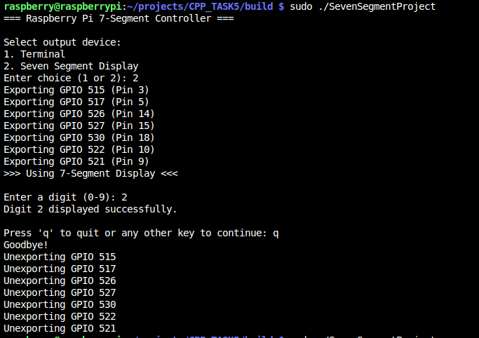
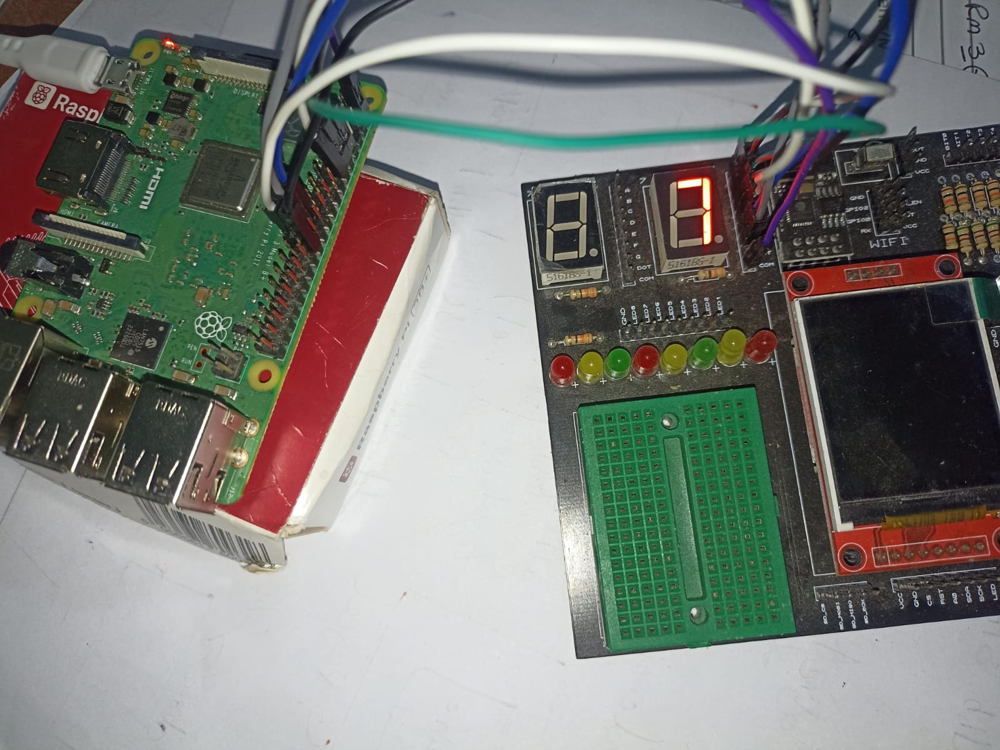

# 🎯 Raspberry Pi 7-Segment Display Controller

A C++ application demonstrating advanced OOP concepts with hardware interaction on Raspberry Pi.

---

## 📋 Project Overview

This project implements a digit display system that reads input from terminal and outputs to either:
- **Terminal** (console output)
- **7-Segment Display** (GPIO hardware)

Output destination is selected **at runtime** using polymorphism.

---

## 🏗️ Architecture

### Diamond Inheritance Pattern

```
                    Stream
                   (virtual)
                      │
            ┌─────────┴─────────┐
            │                   │
         IStream             OStream
        (terminal           (abstract
         input)              output)
            │                   │
            └─────────┬─────────┘
                      │
        ┌─────────────┴─────────────┐
        │                           │
   SevenSegment                 Terminal
   (GPIO output)            (cout output)
```

### Project Structure

```
CPP_TASK5/
├── include/
│   ├── Stream.hpp
│   ├── IStream.hpp
│   ├── OStream.hpp
│   ├── SevenSegment.hpp
│   ├── Terminal.hpp
│   └── gpio.hpp
├── src/
│   ├── Stream.cpp
│   ├── IStream.cpp
│   ├── OStream.cpp
│   ├── SevenSegment.cpp
│   ├── Terminal.cpp
│   └── gpio.cpp
├── app/
│   └── main.cpp
├── CMakeLists.txt
├── terminalOutput.png
├── HardwareOutput.png
└── README.md
```

### Screenshots
- Terminal

- HW



---

## 🔧 Build Instructions

```bash
rm -rf build\
cmake -S . -B build
cmake --build build
sudo ./SevenSegmentProject
```

---

## ⚡ GPIO Wiring

| Raspberry Pi | 7-Segment |
|--------------|-----------|
| GPIO 17 | Segment A |
| GPIO 18 | Segment B |
| GPIO 19 | Segment C |
| GPIO 20 | Segment D |
| GPIO 21 | Segment E |
| GPIO 22 | Segment F |
| GPIO 23 | Segment G |
| GND | Common |

---

## 📚 C++ Concepts Demonstrated

| Concept | Where Used |
|---------|------------|
| Diamond Inheritance | Stream → IStream/OStream → SevenSegment/Terminal |
| Virtual Inheritance | `class IStream : virtual public Stream` |
| Pure Virtual Functions | `virtual void writeDigit(int) = 0` |
| Polymorphism | Runtime output selection |
| Smart Pointers | `std::shared_ptr` in main.cpp |
| Rule of Five | GpioPin class |
| Move Semantics | GpioPin ownership transfer |
| RAII | GPIO export/unexport in constructor/destructor |
| Exception Handling | Input validation |
| Namespaces | `HardwareIO`, `MCAL::GPIO` |

---

## ❓ Review Questions

### Diamond Inheritance

**Q1:** What is the diamond problem?
<details>
<summary>Answer</summary>
When a class inherits from two classes that share a common base, the base class constructor/destructor gets called twice. Virtual inheritance solves this.
</details>

**Q2:** Why use `virtual` inheritance?
<details>
<summary>Answer</summary>
To ensure only ONE copy of the base class exists in the final derived class.
</details>

---

### Virtual Functions

**Q3:** Why does `Stream` have a virtual destructor?
<details>
<summary>Answer</summary>
To ensure derived class destructors are called when deleting through base pointer. Without it, memory/resource leaks occur.
</details>

**Q4:** What does `= 0` mean in `virtual void writeDigit(int) = 0`?
<details>
<summary>Answer</summary>
Makes it a pure virtual function, making the class abstract. Derived classes MUST implement it.
</details>

---

### Rule of Five

**Q5:** When do you need Rule of Five?
<details>
<summary>Answer</summary>
When your class manages resources (raw pointers, file handles, hardware). If you write a custom destructor, you probably need all five.
</details>

**Q6:** Why is copy deleted but move allowed in `GpioPin`?
<details>
<summary>Answer</summary>
Copy would create two objects owning same GPIO pin → double unexport. Move transfers ownership safely.
</details>

---

### Smart Pointers

**Q7:** Difference between `unique_ptr` and `shared_ptr`?
<details>
<summary>Answer</summary>

| Feature | unique_ptr | shared_ptr |
|---------|------------|------------|
| Can be copied? | No | Yes |
| Multiple owners? | No | Yes |
| Overhead? | None | Reference counting |

</details>

**Q8:** Why use `shared_ptr` in main.cpp?
<details>
<summary>Answer</summary>
One object needs to be accessed through two different base class pointers (IStream* and OStream*). shared_ptr allows multiple references to same object.
</details>

---

### Move Semantics

**Q9:** What is `noexcept` and why use it with move?
<details>
<summary>Answer</summary>
Promises the function won't throw exceptions. STL containers (vector) use move only if it's noexcept, otherwise they fall back to copy.
</details>

**Q10:** Why set `ref.PinNumber = -1` in move constructor?
<details>
<summary>Answer</summary>
To invalidate the moved-from object so its destructor doesn't unexport the GPIO pin (which is now owned by the new object).
</details>

---

### RAII

**Q11:** What is RAII?
<details>
<summary>Answer</summary>
Resource Acquisition Is Initialization. Acquire resources in constructor, release in destructor. Guarantees cleanup even with exceptions or early returns.
</details>

---

### General C++

**Q12:** Difference between `const` and `constexpr`?
<details>
<summary>Answer</summary>

| Keyword | Evaluated At |
|---------|--------------|
| const | Runtime (can use runtime values) |
| constexpr | Compile time (must know value at compile time) |

</details>

**Q13:** What does `c_str()` do?
<details>
<summary>Answer</summary>
Converts `std::string` to `const char*` (C-style string). Needed for C functions like `open()`.
</details>

**Q14:** Why always `close(fd)` after `open()`?
<details>
<summary>Answer</summary>
To release file descriptor. Limited number available. Not closing causes resource exhaustion ("Too many open files" error).
</details>

---

## 🎓 Key Takeaways

1. **Virtual inheritance** → Solves diamond problem
2. **Virtual destructor** → Required for polymorphic base classes
3. **Rule of Five** → Required when managing resources
4. **RAII** → Automatic resource management via constructors/destructors
5. **Smart pointers** → Prefer over raw `new`/`delete`
6. **`noexcept` move** → Required for STL container compatibility

---

## 👤 Author

Abdelfattah Moawed


